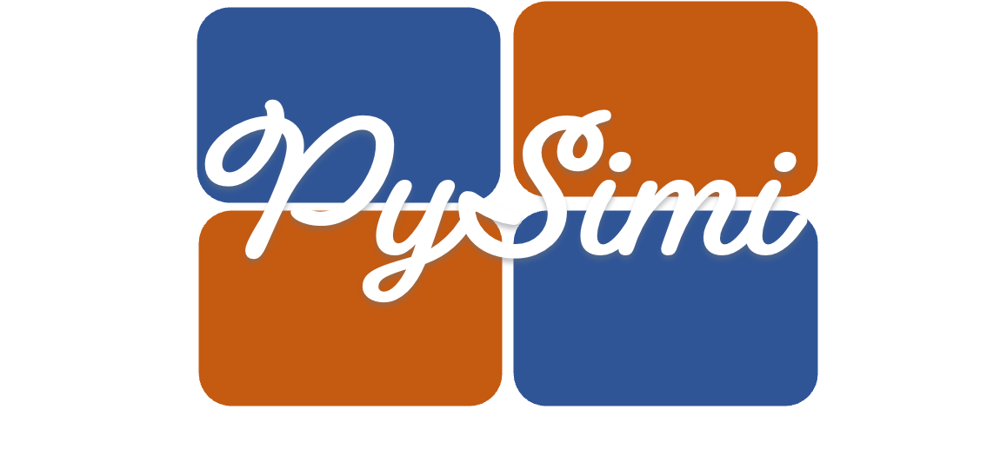
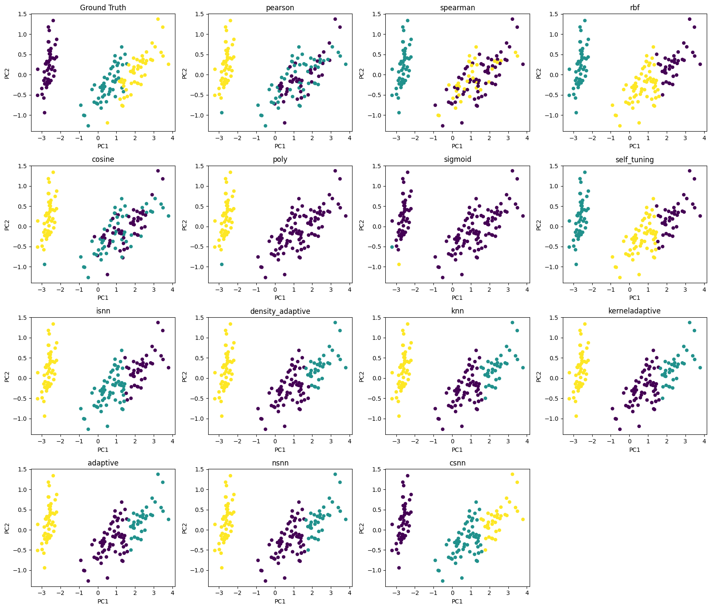
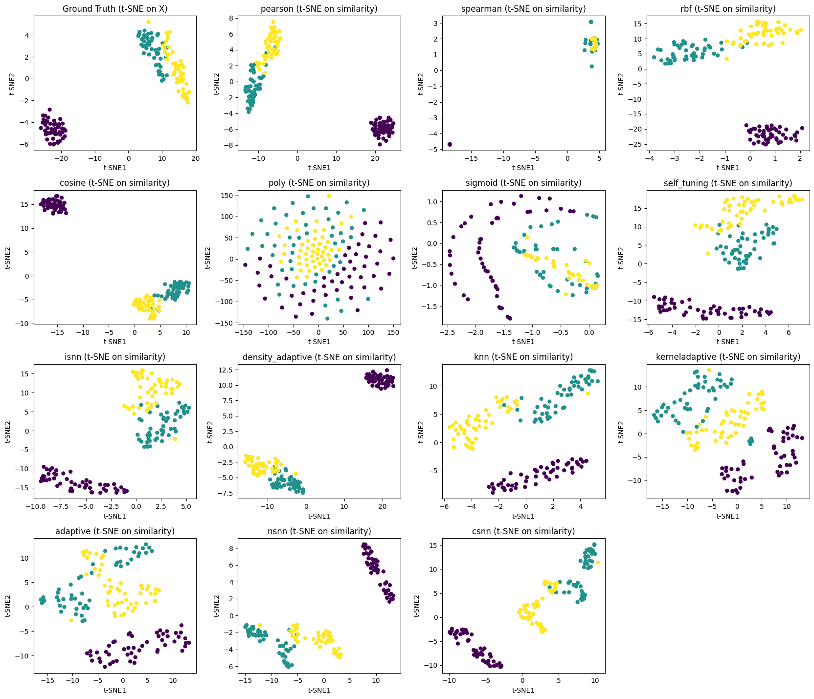

# PySimi
<p align="center">
  
</p>

PySimi is a Python toolkit for constructing similarity matrices and applying them to
**spectral clustering** and **dimensionality reduction**.
It provides a unified interface for classical and recently proposed similarity
definitions, enabling flexible comparison across different similarity measures.

---

## Installation

```bash
pip install pysimi-toolkit
```

---

## Quick Start Example (Iris Dataset)

This example demonstrates how to construct different similarity matrices using **PySimi**
and apply **spectral clustering** on the Iris dataset.
Both **PCA** and **t-SNE** visualizations are provided for comparison.

---

### 1. Load data and imports

```python
import math
import numpy as np
import matplotlib.pyplot as plt
from sklearn.datasets import load_iris
from sklearn.decomposition import PCA

from pysimi.api import build_similarity
from pysimi.algorithms.spectral import spectral_clustering
```

```python
# Load Iris dataset
iris = load_iris()
X = iris.data
y_true = iris.target

# PCA for visualization
X_pca = PCA(n_components=2).fit_transform(X)
```

---

### 2. Similarity methods supported by PySimi

```python
methods = [
    "pearson", "spearman", "rbf", "cosine", "poly", "sigmoid","knn",
    "kerneladaptive", "adaptive", "nsnn", "csnn"
]
```

---

### 3. Hyperparameter configuration

```python
k = 15
sigma = 1.0

method_kwargs = {
    "rbf": dict(sigma=sigma),
    "cosine": dict(),
    "pearson": dict(),
    "spearman": dict(),
    "poly": dict(),
    "sigmoid": dict(),

    "nsnn": dict(k=k, sigma=sigma),
    "csnn": dict(k=k, sigma=sigma),
    "adaptive": dict(k=k),
    "kerneladaptive": dict(k=k, sigma=sigma),
    "knn": dict(k_neighbors=k)
}
```

---

### 4. Spectral clustering with different similarity matrices

```python
labels_dict = {}

for method in methods:
    S = build_similarity(X, method=method, **method_kwargs[method])
    labels = spectral_clustering(S, num_clusters=3, random_state=42)
    labels_dict[method] = labels
```

---

### 5. PCA visualization (ground truth vs clustering results)

```python
methods_with_gt = ["ground_truth"] + methods
labels_all = {"ground_truth": y_true, **labels_dict}

cols = 4
rows = math.ceil(len(methods_with_gt) / cols)

fig, axes = plt.subplots(rows, cols, figsize=(4.2 * cols, 3.6 * rows))
axes = axes.flatten()

for i, name in enumerate(methods_with_gt):
    ax = axes[i]
    ax.scatter(X_pca[:, 0], X_pca[:, 1], c=labels_all[name], s=25)
    ax.set_title("Ground Truth" if name == "ground_truth" else name)
    ax.set_xlabel("PC1")
    ax.set_ylabel("PC2")

for ax in axes[len(methods_with_gt):]:
    ax.axis("off")

plt.tight_layout()
plt.show()
```
<p align="center">
  
</p>
---

### 6. t-SNE visualization on similarity matrices

```python
from pysimi.algorithms.tsne import tsne
```

```python
fig, axes = plt.subplots(rows, cols, figsize=(4.2 * cols, 3.6 * rows))
axes = axes.flatten()

for i, name in enumerate(methods_with_gt):
    ax = axes[i]

    if name == "ground_truth":
        Z, _ = tsne(X=X, random_state=42)
        title = "Ground Truth (t-SNE on X)"
    else:
        S = build_similarity(X, method=name, **method_kwargs[name])
        Z, _ = tsne(S=S, random_state=42)
        title = f"{name} (t-SNE on similarity)"

    ax.scatter(Z[:, 0], Z[:, 1], c=y_true, s=25)
    ax.set_title(title)
    ax.set_xlabel("t-SNE1")
    ax.set_ylabel("t-SNE2")

for ax in axes[len(methods_with_gt):]:
    ax.axis("off")

plt.tight_layout()
plt.show()
```
<p align="center">
  
</p>
---

## Notes

- **PyPI package name**: `pysimi-toolkit`
- **Import name**: `pysimi`
- The similarity matrix construction is modular and can be easily extended
  with custom similarity definitions.

---

## License

This project is released under the MIT License.